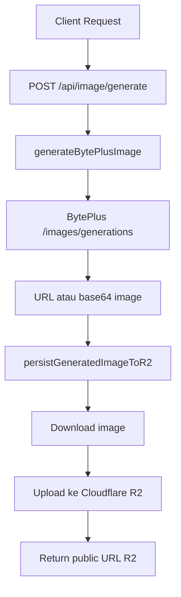

# Dokumentasi API Image AI + Cloudflare R2

Dokumen ini menjelaskan endpoint image AI yang generate gambar lewat BytePlus lalu menyimpan hasilnya ke Cloudflare R2.

## Tujuan

Endpoint ini dipakai untuk:

1. menerima `prompt` dari client
2. generate gambar ke BytePlus
3. menyimpan hasil gambar ke Cloudflare R2
4. mengembalikan URL publik gambar dari R2

Dokumentasi ini cocok jika Anda ingin mengimplementasikan fungsi yang sama di sistem lain.

---

## Ringkasan Arsitektur

Di project `wa-ai`, fungsi yang dipakai adalah:

- `generateBytePlusImage(...)` dari `lib/byteplus.ts`
- `persistGeneratedImageToR2(...)` dari `lib/r2.ts`

Alur kerjanya:



---

## Endpoint yang Disarankan

Endpoint internal yang disarankan:

- `POST /api/image/generate`

> Catatan: di project saat ini belum ada endpoint image-only bawaan. Yang ada baru pipeline creator. Jadi endpoint ini adalah bentuk yang disarankan untuk dipakai di sistem lain atau ditambahkan ke project ini.

---

## Request Body

Field yang diterima:

- `prompt` → wajib
- `model` → opsional
- `size` → opsional

### Contoh request JSON

```json
{
  "prompt": "Create a premium hospitality campaign visual, real hotel manager, navy and electric blue palette, clean layout, modern and trustworthy, no logo, no watermark",
  "model": "seedream-4-5-251128",
  "size": "1024x1024"
}
```

### Contoh request cURL

```bash
curl --request POST \
  --url http://localhost:3000/api/image/generate \
  --header 'Content-Type: application/json' \
  --data '{
    "prompt": "Create a premium hospitality campaign visual, real hotel manager, navy and electric blue palette, clean layout, modern and trustworthy, no logo, no watermark",
    "model": "seedream-4-5-251128",
    "size": "1024x1024"
  }'
```

---

## Response Sukses

Jika sukses, endpoint akan mengembalikan URL hasil upload ke R2.

### Contoh response

```json
{
  "ok": true,
  "provider": "byteplus",
  "prompt": "Create a premium hospitality campaign visual, real hotel manager, navy and electric blue palette, clean layout, modern and trustworthy, no logo, no watermark",
  "model": "seedream-4-5-251128",
  "size": "1024x1024",
  "sourceImageUrl": "https://example-cdn.byteplus.com/generated/abc123.png",
  "r2Key": "ai-images/2026/04/1714380000-uuid.jpg",
  "imageUrl": "https://pub.example.com/ai-images/2026/04/1714380000-uuid.jpg",
  "contentType": "image/jpeg",
  "bytes": 483221
}
```

### Penjelasan field response

- `ok` → status sukses/gagal
- `provider` → provider image AI yang dipakai
- `prompt` → prompt final yang dipakai
- `model` → model image yang dipakai
- `size` → ukuran image request
- `sourceImageUrl` → URL asli dari provider jika provider return URL
- `r2Key` → path object di bucket R2
- `imageUrl` → URL publik hasil akhir dari R2
- `contentType` → MIME type file hasil upload
- `bytes` → ukuran file hasil upload

---

## Response Error

### Contoh jika prompt kosong

```json
{
  "ok": false,
  "reason": "prompt is required"
}
```

### Contoh jika konfigurasi BytePlus belum ada

```json
{
  "ok": false,
  "reason": "BytePlus API key is required for image generation."
}
```

### Contoh jika konfigurasi R2 belum lengkap

```json
{
  "ok": false,
  "reason": "Cloudflare R2 configuration is incomplete. Required env: R2_ACCESS_KEY, R2_SECRET_KEY, R2_BUCKET, R2_ENDPOINT, R2_PUBLIC_URL."
}
```

### Contoh jika model salah

```json
{
  "ok": false,
  "reason": "BytePlus Image Model \"seed-2-0-pro-260328\" tidak valid untuk endpoint /images/generations. Gunakan model image seperti seedream-4-5-251128 atau seededit-3-0-i2i-250628."
}
```

---

## Alur Internal Endpoint

### 1. Validasi input

Endpoint membaca body JSON lalu memastikan `prompt` terisi.

Jika `prompt` kosong, return `400`.

### 2. Generate image ke BytePlus

Fungsi:

- `generateBytePlusImage({ prompt, model, size })`

Fungsi ini akan:

- membaca API key, base URL, dan image model
- validasi model image
- memanggil endpoint BytePlus:
  - `POST {baseUrl}/images/generations`
- membaca hasil dari:
  - `data[0].url`, atau
  - `data[0].b64_json`

Jika gagal, fungsi melempar error.

### 3. Simpan ke Cloudflare R2

Fungsi:

- `persistGeneratedImageToR2(sourceImage)`

Fungsi ini akan:

1. download image dari URL provider atau decode dari data URL
2. cek ukuran file
3. jika file terlalu besar, sistem bisa optimasi/compress image
4. upload hasilnya ke bucket R2
5. membentuk public URL final

Jadi hasil akhir yang sebaiknya dipakai frontend adalah:

- `imageUrl` dari R2

bukan URL mentah dari provider.

---

## Konfigurasi yang Dibutuhkan

### Konfigurasi BytePlus

Minimal yang harus tersedia:

- `ARK_API_KEY`
- `ARK_BASE_URL`
- `ARK_IMAGE_MODEL`

Default base URL pada project ini:

- `https://ark.ap-southeast.bytepluses.com/api/v3`

Contoh model valid:

- `seedream-4-5-251128`
- `seededit-3-0-i2i-250628`

Contoh model tidak valid untuk endpoint image:

- `seed-2-0-pro-260328`

### Konfigurasi Cloudflare R2

Minimal yang harus tersedia:

- `R2_ACCESS_KEY`
- `R2_SECRET_KEY`
- `R2_BUCKET`
- `R2_ENDPOINT`
- `R2_PUBLIC_URL`

---

## Contoh Implementasi Route

Berikut contoh route jika Anda ingin menambahkannya ke project Next.js.

```ts
import { NextRequest, NextResponse } from "next/server";

import { generateBytePlusImage } from "@/lib/byteplus";
import { persistGeneratedImageToR2 } from "@/lib/r2";

export async function POST(request: NextRequest) {
  try {
    const body = await request.json();

    const prompt = String(body?.prompt ?? "").trim();
    const model = body?.model ? String(body.model).trim() : undefined;
    const size = body?.size ? String(body.size).trim() : undefined;

    if (!prompt) {
      return NextResponse.json(
        { ok: false, reason: "prompt is required" },
        { status: 400 }
      );
    }

    const sourceImage = await generateBytePlusImage({
      prompt,
      model,
      size
    });

    const stored = await persistGeneratedImageToR2(sourceImage);

    return NextResponse.json({
      ok: true,
      provider: "byteplus",
      prompt,
      model: model || null,
      size: size || "1024x1024",
      sourceImageUrl: sourceImage.startsWith("data:image/") ? null : sourceImage,
      r2Key: stored.key,
      imageUrl: stored.url,
      contentType: stored.contentType,
      bytes: stored.size
    });
  } catch (error) {
    const reason = error instanceof Error ? error.message : "Unknown error";
    return NextResponse.json({ ok: false, reason }, { status: 500 });
  }
}
```

---

## Kontrak Endpoint

### Method

- `POST`

### URL

- `/api/image/generate`

### Content-Type

- `application/json`

### Body

```json
{
  "prompt": "string",
  "model": "string (optional)",
  "size": "string (optional)"
}
```

### Success Response

```json
{
  "ok": true,
  "provider": "byteplus",
  "prompt": "string",
  "model": "string | null",
  "size": "string",
  "sourceImageUrl": "string | null",
  "r2Key": "string",
  "imageUrl": "string",
  "contentType": "string",
  "bytes": 0
}
```

### Error Response

```json
{
  "ok": false,
  "reason": "string"
}
```

---

## Kenapa Perlu Simpan ke R2?

Menyimpan hasil ke Cloudflare R2 lebih aman dan stabil dibanding langsung memakai URL dari provider karena:

- URL provider bisa sementara / presigned
- Anda punya kontrol penuh atas file final
- lebih mudah dipakai ulang oleh frontend, CMS, automation, atau social publisher
- lebih mudah audit, cache, dan lifecycle management
- bisa dipakai sebagai sumber media permanen untuk publish ke platform lain

---

## Rekomendasi Implementasi di Sistem Lain

Kalau Anda ingin memindahkan fitur ini ke sistem lain, saya sarankan pisahkan menjadi 3 layer:

### 1. Provider layer

Tugas:

- kirim prompt ke image provider
- parsing response provider

Contoh fungsi:

- `generateBytePlusImage()`

### 2. Storage layer

Tugas:

- download hasil image
- upload ke storage permanen
- return public URL

Contoh fungsi:

- `persistGeneratedImageToR2()`

### 3. API layer

Tugas:

- validasi request
- panggil provider layer
- panggil storage layer
- return response JSON

Contoh endpoint:

- `POST /api/image/generate`

Dengan struktur ini, nanti kalau Anda ganti provider dari BytePlus ke provider lain, layer API dan storage tidak perlu banyak berubah.

---

## Kesimpulan

Endpoint image AI yang disarankan adalah endpoint sederhana yang:

1. menerima prompt
2. generate image ke BytePlus
3. simpan hasil ke Cloudflare R2
4. mengembalikan URL publik final

Kalau dipakai untuk production, URL yang dipakai aplikasi sebaiknya selalu `imageUrl` hasil R2, bukan URL mentah dari provider.
